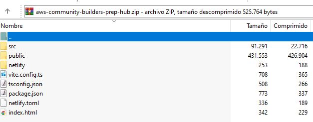

# AWS Community Builders Prep Hub

Contiene información del programa oficial de AWS Community Builders, guías para aplicar al programa, consejos, links utiles y revisión de material de postulación con IA.

## Requisitos previos

- [Node.js](https://nodejs.org/) (v18 o superior)
- [AWS CLI](https://docs.aws.amazon.com/cli/latest/userguide/getting-started-install.html) instalado y configurado (`aws configure`)
- [AWS SAM CLI](https://docs.aws.amazon.com/serverless-application-model/latest/developerguide/install-sam-cli.html) instalado
- Una cuenta de AWS con permisos para crear funciones Lambda y buckets S3
- API Key de Google Gemini **o** acceso habilitado a Amazon Bedrock (según la opción elegida)

## Desplegar la Lambda de revisión de la postulación

### 1. Instalar dependencias y empaquetar

Opción con apikey de gemini
```bash
cd aws-lambda/review
npm install
zip -r function.zip index.mjs package.json node_modules
```
O! 

Opción con Amazon Bedrock y Nova
```bash
cd aws-lambda-bedrock/review
npm install
zip -r function.zip index.mjs package.json node_modules
```

### 2. Crear la función en AWS via SAM

```bash
sam build
sam deploy --guided
```


### 3. Configuración de la Lambda

Ingresar a la consola de AWS a la lambda que se creo en el punto anterior e ir a la pestaña Configuration > Environment variables y completar los datos necesarios (ya sea con la opcion de Gemini o Bedrock. )

## 4. Despliegue Netlify y configuración de la Lambda

En el caso que se quiera desplegar el frontend en netlify, seguir los pasos:

1- Crear el proyecto en netlify.

2- Subir el frontend manualmente en Projects → NombreProyecto → Deploys → Need to update your project?. Agregar los siguientes archivos a un zip.



3- En Netlify → Site settings → Environment variables, agregá:
- `VITE_LAMBDA_REVIEW_URL` = la URL de la lambda del paso 3

## 5. Despliegue el frontend en S3 y CloudFront

A diferencia de Netlify, S3 no tiene pipeline de build propio. Las variables de entorno de Vite se compilan dentro del bundle JS en el momento del `npm run build`, por eso el build se realiza **localmente** antes de subir.

### 1. Configurar la variable de entorno y hacer el build

Asegurate que en tu `.env` local esté la URL correcta de la Lambda:
```
VITE_LAMBDA_REVIEW_URL=https://xxxx.lambda-url.us-east-1.on.aws/
```

Luego ejecutar el build:
```bash
npm run build
```
Esto genera la carpeta `dist/` con los archivos estáticos listos para subir.

### 2. Crear el bucket S3 y subir los archivos

1. Crear un bucket S3 en la consola de AWS.
2. Habilitar **Static website hosting** en la pestaña *Properties* del bucket.
3. En la pestaña *Permissions*, deshabilitar el bloqueo de acceso público y agregar la siguiente bucket policy para que sea público:
```json
{
  "Version": "2012-10-17",
  "Statement": [{
    "Effect": "Allow",
    "Principal": "*",
    "Action": "s3:GetObject",
    "Resource": "arn:aws:s3:::NOMBRE-DEL-BUCKET/*"
  }]
}
```
4. Subir el contenido de la carpeta `dist/` al bucket:
```bash
aws s3 sync dist/ s3://NOMBRE-DEL-BUCKET --delete
```

### 3. Configurar CloudFront (opcional pero recomendado)

1. Crear una distribución CloudFront apuntando al bucket S3 como origen.
2. Configurar el **Default root object** como `index.html`.
3. Agregar un **Error page** para el código 403/404 redirigiendo a `/index.html` con código de respuesta 200 (necesario para el routing de React).
4. Una vez creada la distribución, usar la URL de CloudFront (tipo `https://xxxx.cloudfront.net`) como origen de acceso.

### 4. Actualizar el ALLOWED_ORIGIN en la Lambda

En la consola de AWS Lambda → pestaña *Configuration* → *Environment variables*, actualizar:
- `ALLOWED_ORIGIN` = la URL de CloudFront (ej: `https://xxxx.cloudfront.net`) o la URL del bucket S3

---

## Licencia

Este proyecto está bajo la licencia MIT. Ver el archivo [LICENSE](./LICENSE) para más detalles.
